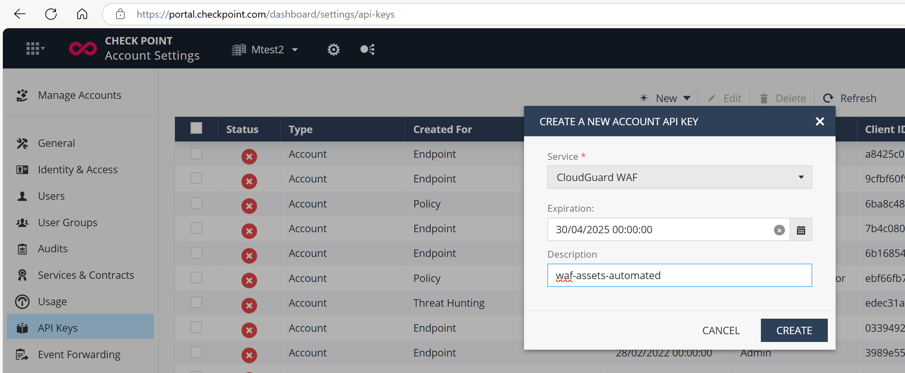
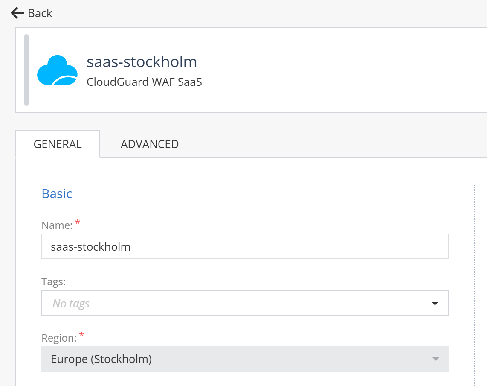
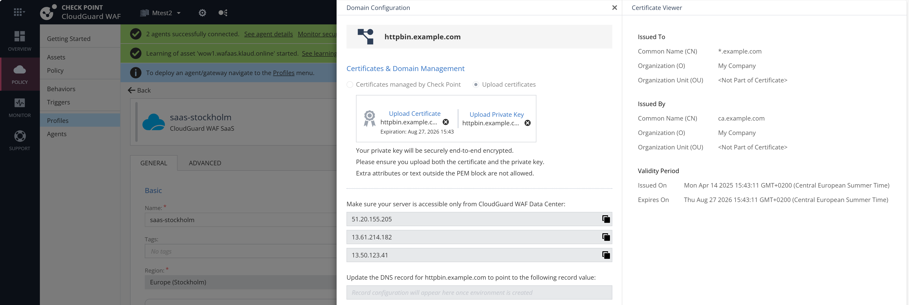

# Declarative creation or WAFaaS assets

### Dependencies

```shell
# install Deno - https://docs.deno.com/runtime/getting_started/installation/
curl -fsSL https://deno.land/install.sh | sh

# install dotenvx - https://dotenvx.com/
curl -fsS https://dotenvx.sh | sudo sh

# open terminal again with new environment
exit

# check versions
deno --version
dotenvx --version
```

### WAF API key

Login to your CloudGuard WAF tenant and setup new admin keys for CloudGuard WAF:
https://portal.checkpoint.com/dashboard/settings/api-keys



Create new `.env` file in the root of the project and add the following variables:

```env
# .env
# WAF API key
WAFKEY=xxx
# WAF API secret
WAFSECRET=yyy
# AUTH URL
WAFAUTHURL=https://cloudinfra-gw.portal.checkpoint.com/auth/external
```

You may validate your API key using the following command:

```shell
# validate WAF API key
dotenvx run -- env | grep ^WAF
```

### Test certificate

Optional: lets create self signed wildcard certificates for the demo.

```shell
# create new CA
openssl genrsa -out ca.key 2048
openssl req -x509 -new -nodes -key ca.key -sha256 -days 1024 -out ca.crt -subj "/C=US/ST=CA/L=San Francisco/O=My Company/CN=ca.example.com"

# create a new server key and issue a certificate
openssl genrsa -out server.key 2048
openssl req -new -key server.key -out server.csr -subj "/C=US/ST=CA/L=San Francisco/O=My Company/CN=*.example.com" -addext "subjectAltName = DNS:*.example.com"
openssl x509 -req -in server.csr -CA ca.crt -CAkey ca.key -CAcreateserial -out server.crt -days 500 --extfile <(echo "subjectAltName = DNS:*.example.com" )

# check what we have got
openssl x509 -in server.crt -text -noout | grep CN
openssl x509 -in server.crt -text -noout | grep DNS
# check CA cert too
openssl x509 -in ca.crt -text -noout | grep CN

# summary:
ls -la ca.*
ls -la server.*
```

### Create or review WAFaaS Profile

Visit WAFaaS asset in UI and note asset name and region.

https://portal.checkpoint.com/dashboard/appsec/cloudguardwaf#/waf-policy/profiles/ 

For example, the profile type is `CloudGuard WAF SaaS Profile` name is `saas-stockholm` and the region for Stockholm is `eu-north-1`.

| **Location** | **AWS Region Name** |
|--------------|---------------------|
| Stockholm    | eu-north-1          |
| Milan        | eu-south-1          |
| Ireland      | eu-west-1           |




### Review assets.yaml definiton

`assets.yaml` file contains the WAFaaS asset definition. Here is typical template based on inputs we know:

```yaml
config:
  profile: "saas-stockholm"
  region: "eu-north-1"

assets:
  - name: "httpbin.example.com" # asset name
    domain: "httpbin.example.com" # front end url without https:// prefix
    host: "httpbin.org" # host header sent to upstream
    upstream: "https://httpbin.org"
    cert_pem: "server.crt" # certificate file location
    cert_key: "server.key" # key file location

  - name: "ifconfig.example.com" # asset name
    domain: "ifconfig.example.com" # front end url without https:// prefix
    host: "ifconfig.me" # host header sent to upstream
    upstream: "https://ifconfig.me"
    cert_pem: "server.crt" # certificate file location
    cert_key: "server.key" # key file location
```

### Execute asset provisioning

Script checks if asserts already exist and if not, creates them. It also uploads custom certificates as provided in files. 
It gives summary of service DNS recorts - CNAMEs to WAF service.

```shell
# check assets to create
cat assets.yaml

# execute deployment
dotenvx run -- deno run -A deploy-waf-with-own-cert.ts
```

### Expected results

Assets are created per YAML declaration in `assets.yaml` file.
Uploaded certificates are used for the assets and can be confirmed in the UI under the profile.



### Troubleshooting

- so far this is PoC/concept and if you want to run again for same list of assets, you might want to delete them first, publish&enforce and start again
